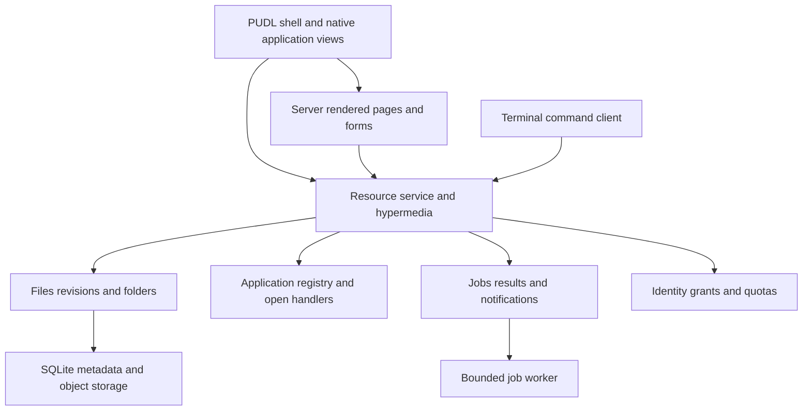

# PUDL Desktop showcase proposal

This document explores a desktop shell at `pudl.parkscomputing.com`, backed by a resource-oriented service that provides files, applications, jobs, and other operating-system-like facilities. It is a proposal for Paul Parks, researched on 3 October 2026. Paul accepted it on 4 October 2026 with the decisions in the next section, which override anything later in the document that disagrees with them.

## Decisions, 4 October 2026

Paul decided these on 4 October 2026, after a review of the proposal.

- **The project goes ahead**, as PUDL Desktop, a separate repository with its own version, consuming tagged PUDL releases.
- **The service is written in Go.**
- **Documents are Markdown first.** Paul writes Markdown almost exclusively, and HTML only when he must, so the desktop treats Markdown as the document format and HTML as the way Markdown is presented. One of the project's theses is to show how good Markdown-first editing can be, and how Markdown documents can work together, in ways that are new or that exist already but have never been shown in one place. The section on Markdown below sets this out.
- **Stage 1's Preview shows Markdown, HTML and images.** PDF moves to stage 3.
- **The terminal is based on the one Parks Computing already has**, adapted to the desktop's resource service in place of the site's filesystem. It stays a thin command shell over desktop resources, and it reaches them through the same links and forms the browser follows, so that it is the second client that proves the hypermedia is real. There is no separate vendor JSON media type.
- **Data Workbench starts on the server**, running its queries in the service's SQLite and returning HTML tables. Browser engines such as DuckDB-Wasm, a data grid and a chart library come later, each after a prototype shows it is needed.
- **The public temporary workspace has fixed limits before any design work**: text-only writes, a small quota, a short expiry, and no ZIP import in stage 1.
- **Tela and Awan Saya are unrelated** to this project. The desktop does not integrate with them, and the comparison with them later in this document can be ignored.
- **The phone form follows YAVCHN first and parkscomputing.com second**, since both already work well on a phone and on a desktop.
- **The first design task is the walk-through** that takes one Markdown file from creation through editing, a conflict, export and deletion, through both the browser's HTML forms and the terminal, before any code is written.
- **PUDL Desktop is also PUDL's conformance harness.** Its coverage manifest maps to the conformance checklists in the PUDL specification, so each scenario it runs is evidence for a checklist item.

I recommend building **PUDL Desktop** as a separate application with a small, real service underneath it. Its first useful release should let someone work on a document across Files, Editor, Terminal, and a data workbench, save the result, and reopen the workspace from its URL. Add a few good games and a design laboratory so the desktop has both personality and unusually broad interaction coverage.

The main risk is scope. A browser desktop can easily become an unfinished operating system, office suite, package manager, and hosting platform at once. The project will succeed if applications share a modest set of well-defined services and each release completes a useful workflow. A large catalog of windows containing unrelated websites would demonstrate much less of PUDL.

The canonical [Architectural Principles](<C:/Users/paul/OneDrive/Documents/Architectural Principles.md>) apply. The current [PUDL contract](https://github.com/paulmooreparks/pudl/blob/main/docs/CONTRACT.md), [menu conventions](https://github.com/paulmooreparks/pudl/blob/main/docs/MENU-BARS.md), and [persistent sidebar contract](https://github.com/paulmooreparks/pudl/blob/main/docs/PERSISTENT-SIDEBAR.md) are the starting point. This proposal does not change those contracts.

## What would make this worth building

Parks Computing already demonstrates a site that grows into a workspace. YAVCHN demonstrates repeated reader instances, live content, and navigation within a mounted application. PUDL Desktop could show what happens when the workspace itself is the product.

The strongest demonstration is continuity. A user generates barcodes from a CSV file, opens the output in Preview, adds a chart to a report, and exports a bundle. Another user opens a sample project, edits a Markdown document, inspects its revisions, and restores a saved workspace. Every application uses the same file identities, open/save experience, command conventions, and job reporting.

That makes several things visible that a reference page cannot establish. Unsaved documents have to survive window activation. A file rename must not strand an editor. Cancellation must work while another application is in front. A narrow screen must preserve the same work. Permissions and failures must be understandable in both a graphical application and the terminal.

There is also a credible reason to return. Small useful tools, private scratch work, a good data viewer, and a few games can earn repeat visits. The theme laboratory and reproducible workspace links would make the site useful to PUDL adopters even if they never use it as their daily desktop.

I would use **PUDL Desktop** as the initial public name. “PUDL OS” is entertaining, but it suggests device management, arbitrary native programs, and a degree of isolation that the first release would not provide. “PUDL Workbench” would fit a developer-focused subset, but understates the games and everyday applications envisioned here.

## Markdown first

Markdown is the desktop's document format, and HTML is how it is shown. A document is a Markdown file; its rendered form is a representation of that file, never a second copy that can drift from it. This gives the project a thesis of its own beside PUDL's: that one plain-text format, edited well, can carry most of what a person writes, and that documents in it can work together in ways a word processor's files cannot.

These are the things I would expect the desktop to show, roughly in the order they become possible.

- The editor makes Markdown pleasant to write without hiding it: an outline from the headings, link and image completion against the workspace's own files, a preview that keeps its place as the source scrolls, tables that can be edited as tables, and a reliable round trip so the source never changes unless the writer changed it.
- A link from one Markdown file to another is a real link between resources, so renaming a file updates the documents that point at it, a document can list what links to it, and a broken link is something the desktop reports.
- A document can include another, or a part of another by heading, so a long piece can be assembled from shorter ones and each stays readable on its own.
- Front matter holds a document's metadata, and the desktop can list, filter and sort documents by it, which makes a folder of Markdown files into something like a small database without a separate tool.
- Revisions of a Markdown file compare as text, by line and by word, which is where a plain format is far better than a binary one.
- Data Workbench can write its tables and charts into a Markdown document, and a document can embed a saved query whose results are drawn when it is read, so a report stays tied to its data.
- Export turns a Markdown document, or a folder of them, into HTML, a printable page, or a bundle, as a job whose result is a resource.

Some of this exists in tools such as Obsidian, Typora, Pandoc and static site generators, and that is fine. Few have shown all of it in one place, on the web, through ordinary addresses, with the same document reachable from a terminal. The flavour of Markdown and the rules for links, inclusion and front matter are design decisions for the walk-through, and they should follow an existing specification, CommonMark with clearly listed extensions, rather than invent one.

## Three possible shapes

| Shape | Benefit | Cost | Recommendation |
| --- | --- | --- | --- |
| Browser-only desktop with local storage | Cheap hosting and private local processing | Difficult cross-device recovery, weak server-rendered fallback, browser storage limits, and no real remote job service | Keep as a possible local scratch mode, not the main architecture |
| PUDL shell with a resource service | Shared documents, real jobs, explicit permissions, reproducible views, and useful application integration | Requires storage operations, authentication choices, and a carefully bounded public sandbox | Build this |
| Full machine environment with containers, emulation, or remote desktops | Genuine shells and existing native applications | Substantial isolation, resource management, latency, licensing, and operational responsibilities | Reserve for a separately operated advanced mode |

The service can reasonably be called a kernel within the project. Its purpose is to mediate access to shared resources and capabilities. It does not need to emulate POSIX, invent virtual memory, or expose one HTTP operation for every machine syscall. HTTP is a good fit for documents and jobs; it is a poor place to send every cursor movement, game frame, or terminal repaint.

## The shell people would see

The shell should retain PUDL's current visual language. Use the raised grouped menu bars, restrained light and dark surfaces, compact title bars, and a taskbar spanning the workspace. A quiet background with a subtle PUDL identity is sufficient. Animated wallpaper and a simulated boot sequence can be optional experiments later; the first useful screen should appear promptly.

This is a proposed desktop arrangement, not a pixel specification:

```text
 [PUDL Desktop  Go  Applets  View  Window  Help] [Editor  File  Edit]   [Search]
 +-------------------+----------------------------------------------------+
 | Places            | Files                    | Editor                  |
 |   Home            | project.csv              | report.md               |
 |   Examples        | report.md                |                         |
 |   Recent          | chart.svg                |                         |
 |   Trash           +--------------------------+-------------------------+
 | Applications      | Terminal                 | Preview                 |
 |   Productivity    |                          |                         |
 |   Development     |                          |                         |
 |   Games           |                          |                         |
 +-------------------+----------------------------------------------------+
 [Sidebar] [Files] [Editor *] [Terminal] [Preview]             [Jobs 1] [Help]
```

The initial workspace should open a short Welcome document and Files pointed at a small example project. It should offer direct actions such as “Edit a report,” “Explore some data,” and “Play a game.” Each action opens a curated workspace whose arrangement and documents have an address. Avoid a compulsory tour or an empty desktop that requires the visitor to discover the launcher first.

The left sidebar contains Places and Applications rather than an article feed. Its persistent handle remains usable when collapsed. It can be hidden by default on smaller screens without losing the explicit toggle in the taskbar. Desktop icons are optional shortcuts to resources; they should never become a second, unrelated filesystem.

The site bar keeps the established order: identity, Go, Applets, View, Window, Help. “Applets” can remain the standard launch menu even when its entries include substantial applications; “Applications” can be the catalog page's heading. If we later change the universal menu name, that belongs in a PUDL-wide convention decision.

The identity menu contains About, desktop settings, workspace/account information, and licensing. Go contains locations and navigation. View controls the shell and receives the active application's permitted contributions. Window owns arrangement and activation. Help includes desktop help and the current application's help. Content operations belong in the application bar. Files should use one Files menu rather than introduce adjacent File and Files identities with nearly identical names.

Applications may open multiple document windows. A single application can also have document tabs inside its window where that is useful, but the distinction must be consistent: a tab is a document within that application instance; a taskbar entry is a window. “Open in another window” should be explicit. Closing a document, closing its view, and stopping a background job are separate actions.

On phones, the shell becomes one foreground application with a usable launcher, taskbar, and pane switching. It should retain meaningful addresses, not shrink a desktop until everything becomes too small. Browser tabs, zoom, and ordinary Back navigation remain available. Fullscreen is an optional browser mode; the shell should never pretend it can replace the browser's trusted chrome.

Useful shell additions include a command palette, Open With, recent documents, drag-and-drop resource transfer, a job center, a notification history, a Properties page, and a consistent conflict-resolution view. Add virtual desktops only after a single workspace works well. Each additional workspace must have an addressable identity rather than a hidden array in local storage.

## The kernel and its boundaries

I would start with one Go service, server-rendered HTML, a SQLite metadata database, and an object directory for file bytes. These are proposed implementation choices, not requirements for PUDL. Go aligns with YAVCHN's current server and permits a straightforward self-hosted binary. ASP.NET Core would also fit Paul's experience and could reuse Parks Computing server infrastructure, but porting its whole content engine would bring unrelated responsibilities.

Keep shell, service, and application modules in a new repository, provisionally `pudl-desktop`. Keep PUDL itself independently versioned. One deployable can contain the initial modules without introducing a network service for each capability. A bounded worker process can run background transformations. Storage and worker interfaces can later change without leaking into the public resource model.



The diagram describes logical responsibility. It does not require the server to make an HTTP call to itself when rendering HTML. Pages and HTTP representations can use the same resource services and authorization rules in process.

### Proposed resource model

The following addresses are illustrative. Clients discover actual addresses from representations and must not construct these paths as a hidden protocol.

| Resource | Purpose | Important behavior |
| --- | --- | --- |
| Service root | Entry links, supported media types, and available collections | Gives a client somewhere to start without knowing route templates |
| Workspace | Named collection of resources and policies | Can be private, a temporary guest workspace, or a read-only example |
| Folder and entry | Navigation and membership | Uses stable identities so a rename does not break open documents |
| File and revision | Metadata, current contents, and immutable historical bytes | Supports media types, sizes, preconditions, and revision links |
| Draft | Recoverable work derived from a file revision | Has an explicit resource identity and conflict state |
| Application registration | Supported document types, entry representations, and requested capabilities | Initially installed by the operator, not arbitrary visitors |
| Export or transformation | Desired result from specified input revisions | Creates a bounded job and exposes its result resources |
| Job | Progress, errors, cancellation availability, and output links | Survives closing its progress window |
| Notification | A durable fact needing attention or a completed-job reference | Remains inspectable after a transient toast disappears |
| Workspace snapshot | Immutable saved arrangement and resource references | Makes a curated or user-created desktop reproducible |
| Grant | Permission to access a resource within a stated scope | Does not turn the resource's ordinary URL into a bearer secret |
| Game | Saved position, settings, and optionally move history | Keeps sharing and resuming independent of an in-memory canvas |

Do not force every resource to masquerade as a file. A job has a lifecycle and cancellation controls; a directory entry has membership; a document has editable representations. The terminal may present some of them through filesystem-like navigation, but their actual semantics should remain visible.

File bytes and metadata need atomic publication rules. A new revision becomes visible only after its bytes are durable and its metadata transaction succeeds. Interrupted writes must not replace the previous good revision. Deletion should initially move an entry into a recoverable Trash resource with a documented retention policy.

### What pure REST would mean here

Fielding's model includes stateless interactions, cache constraints, a uniform interface, and hypermedia controlling application transitions. HTTP endpoints with resource-shaped names are insufficient by themselves. Clients should arrive with knowledge of the media type and relation semantics, then follow representations rather than a hard-coded sequence of endpoint calls. [Fielding's REST chapter](https://ics.uci.edu/~fielding/pubs/dissertation/rest_arch_style.htm), [Fielding on hypertext-driven APIs](https://roy.gbiv.com/untangled/2008/rest-apis-must-be-hypertext-driven).

My proposed contract would therefore make each file representation include the applicable links and forms for opening, editing, copying, exporting, and viewing revisions. A read-only file would omit an edit form. A finished job would expose its outputs and omit cancellation. The server still rechecks every submitted action because a representation can become stale.

HTML is the first hypermedia format. A folder should be navigable and a file editable with ordinary links and forms. Programmatic clients can negotiate a documented vendor media type containing links and typed action descriptors. That format needs defined relation meanings, input fields, methods, accepted representations, and error semantics. A bare JSON object with arbitrary `actions` keys is not a self-sufficient contract.

For example, a CSV file can advertise a form that creates an export resource with its source revision already identified and a choice of output formats. Submission returns a resource location; a pending result links to a job. A client follows the job representation until it offers the output file. The graphical progress window and terminal command use those same controls. This is a proposed interaction design, not an existing PUDL API.

Use conditional updates so two editor windows cannot silently overwrite each other. A failed precondition opens an explicit comparison workflow based on the submitted and current revisions. Retried submissions need a documented duplicate-prevention strategy. Where an operation cannot be undone, its confirmation should describe the resource affected and the consequence.

Authentication credentials identify the caller on every request, and authorization is evaluated against resource state. Do not put a conversational “current directory” or “current document” on the server and require subsequent calls to depend on it. A terminal request supplies the resource it means. Long-lived jobs and files are durable resources, not evidence that the REST stateless constraint has been abandoned.

A notification stream may tell clients which resource changed, but reconnection must recover through addressable state. Begin with conditional polling if it meets the measured need. If Server-Sent Events are added, they should be hints with replay/reconciliation rules. A terminal connected to a real remote pseudoterminal would use an additional streaming protocol; label that boundary honestly instead of claiming the keystroke stream is REST.

### What URL is king would mean

The desktop URL identifies workspace, open views, their resource assignments, foreground window, and meaningful application navigation. Use PUDL's existing window-state mechanism and document the host-owned parameters. The editor's file and revision, the data tool's query resource, and the game's saved position must not exist only in mounted JavaScript objects.

Document contents belong in document resources. An unsaved editor buffer is an explicit draft until saved or discarded; typing every character into the address bar would be absurd. A recoverable draft needs a resource identity or a clearly labelled local recovery record, with an honest limitation if that record cannot be shared. Exporting a workspace that depends on local-only resources must either package them with consent or explain which references another browser cannot resolve.

A mutable workspace resource and an immutable snapshot serve different purposes. A URL to the current workspace can show its evolving documents. “Share this arrangement” can create a snapshot that names particular view state and, when requested, particular document revisions. A URL to that snapshot is the authoritative state reference, not a shortcut to hidden session memory. Compact snapshots avoid unbounded query strings.

Sharing an address must not silently publish private files. A recipient may need permission, or the user may create a separately reviewed public copy. Credentials stay out of URLs. Use Back and Forward for navigation boundaries, while drag previews and text input remain transient until their documented commit points. Replaying history must not repeat a destructive operation or launch a second job.

## Public hosting and private work

For the public showcase, I recommend read-only example projects plus an explicit **Start a temporary workspace** action. Starting creates a bounded server-backed workspace with a displayed expiry. The user can export it or delete it. This exercises the real kernel without requiring registration before the first useful interaction.

Do not copy Parks Computing's current privacy promise into this mode. Its public home filesystem is browser-local; a server-backed desktop workspace would upload the user's documents. The UI needs an obvious storage location and retention statement before the first upload. A separate browser-local scratch area can come later, with its own label and export path.

An account mode would retain work across devices. A self-hosted mode would give the operator a durable private installation. These modes should share the resource model. Differences in available actions, quota, and retention can be represented by capabilities and policy, without making every application contain three storage implementations.

Browser filesystem access should be optional. User-authorized local files and the browser's origin-private storage are different facilities, with different permissions and persistence characteristics. Maintain upload/download fallbacks and test against PUDL's supported browsers before depending on a particular picker or storage API. [MDN File System API](https://developer.mozilla.org/en-US/docs/Web/API/File_System_API).

The first public service should run only registered operations with bounded inputs and outputs. Apply storage, archive expansion, request, CPU, and job concurrency limits. Prevent remote imports from reaching private network addresses. Serve untrusted HTML and active documents outside the trusted shell origin. A ZIP import needs path validation as well as a size limit.

These controls are directly relevant to the proposed features. A public desktop with file uploads, importers, and a terminal invites workloads far beyond clicking a demo. A separate worker process with a constrained filesystem and network policy is preferable to executing transformations inside the HTTP process. Arbitrary native execution is a separate product decision.

## What to reuse from the two sites

The local source review found the following useful starting points. These observations describe the checked-out code on the research date, not a fresh verification of either deployed site.

| Source | Reuse | Adaptation required |
| --- | --- | --- |
| Parks Computing Files, Terminal, and Editor | Shared filesystem experience, xterm.js adapter, CodeMirror adapter, open/save flows, menus, and help | Replace site-specific storage and page routes with kernel resource adapters; preserve the useful interaction behavior |
| Parks Computing barcode tools | Generation, scanning, flash cards, and related forms | Add shared-file input/output and job integration; keep camera activation explicit |
| Parks Computing Sudoku, Conway, and Dice | Working small applications with different interaction styles | Give saved games, rules, and exported patterns durable document formats |
| Parks Computing Theme Studio and Diff | Immediate PUDL relevance and multi-pane workflows | Add theme files, saved comparisons, and links into document revisions |
| YAVCHN readers | Stable reader identity separate from document assignment, split reading/discussion views, and source adapters | Reuse lifecycle and navigation patterns for documents and inspection tools |
| YAVCHN Settings and Classic view | A usable page representation alongside the desktop | Make each application useful outside a window and keep settings addressable |
| YAVCHN background tools | Periodic refresh, filtering, and user-profile inspection patterns | Generalize job/notification presentation instead of copying HN-specific concepts |

Useful local pointers are Parks Computing's `Application/parkscomputing-engine/wwwroot/js/{applets,sitefs,files,terminal,editor}.js` and YAVCHN's README and reader code. Parks Computing's editor explicitly uses a vendored CodeMirror bundle; its public home storage currently uses localStorage. Neither implementation should be treated as a binary-file service ready for this project.

Extract host-neutral adapters only after mapping their dependencies. An applet that assumes a global `pcSiteFs` object or a particular `/page/...` URL cannot be made reusable merely by copying its script into a new catalog. Write a small adapter around the actual resource operations rather than accumulating compatibility globals in the shell.

YAVCHN's repository carries an MIT license. Parks Computing has an `Application/LICENSE` with MIT terms and a Microsoft copyright header; that does not by itself establish that every site-specific asset and contribution was intentionally covered. Since Paul owns the projects, clarify the intended license and attribution when extracting his modules, while retaining third-party notices. This is a packaging task before redistribution, not a reason to discard the existing work.

## Application portfolio

The catalog should distinguish small applets from larger applications through capability and scope, without requiring users to learn two different launch systems. Each application should open in a window or as a page, participate in the common help and menu conventions, and identify the documents it owns.

### The first useful collection

| Application | What makes it substantial | PUDL pressure it creates |
| --- | --- | --- |
| Files | Tree and list views, properties, rename, copy, Trash, upload, download, revisions, and Open With | Selection, context menus, trees, grids, persistent sidebars, progress, and recoverable errors |
| Editor | Multiple documents, search/replace, syntax modes, Markdown preview, revisions, and conflict comparison | Dirty state, document tabs, split panes, scoped shortcuts, close cancellation, and focus |
| Terminal | Resource navigation, text pipelines, job control, script files, and opening results in graphical applications | Keyboard ownership, live output, cancellation, long-running work, and application handoff |
| Data Workbench | Import CSV/JSON, inspect types, filter, run SQL, chart results, and export a report | Large tables, typed forms, validation, nested splits, asynchronous work, and linked documents |
| Preview | Images, text, PDF, metadata, page navigation, print, and export | Zoom, scrolling, page selection, toolbars, loading states, and media fallback |
| Games | Sudoku, Conway, and one polished board game with saved state | Pointer/keyboard equivalence, menus during interaction, pause/resume, sound controls, and compact layouts |
| Settings and Activity | Theme, application defaults, storage, permission visibility, job history, and notifications | Forms, confirmation, status distinctions, accessible feedback, and system-wide consistency |

The terminal should initially be a documented shell over desktop resources and registered commands. `ls`, `cat`, `cp`, a query command, and `open` can operate on the same objects as Files and Editor. This is useful without pretending to be Bash. Publish its grammar and limitations, including quoting, pipelines, cancellation, and error behavior. Treat scripts as content interpreted by that command system. Do not silently turn a command into unrestricted server execution.

Data Workbench is my strongest candidate for the first new flagship application. It offers a serious task while avoiding the scope of an entire office suite. A good first version can import a supplied expenses dataset, identify a malformed value, run a saved query, create a chart, and export both data and chart into a report folder. Later it can add joins, reusable transformations, and larger datasets.

Preview should use renderers as engines and retain PUDL's controls around them. PDF rendering has real accessibility and lifecycle complexity; do not replace a mature accessible viewer with a bitmap-only canvas just to make the toolbar match. A PDF result should have a download/open alternative if the embedded renderer cannot provide an adequate experience.

### Applications worth adding next

**Writer** would provide structured rich text, tables, images, links, outline navigation, and revision comparison. Start with HTML/Markdown import and export. DOCX fidelity, pagination, and collaborative editing are substantial separate features. Reusing an editing engine saves document-model work; it does not supply the product's save semantics, accessibility, or compatibility policy.

**Draw** would provide diagrams, shapes, connectors, layers, alignment, and SVG/PNG export. It would exercise property inspectors, color controls, drag operations, and document undo. A small, coherent vector editor is more useful than embedding a complete whiteboard whose menus and storage bypass the desktop.

**Planner** could combine a task list, calendar, simple project board, and reminders. Keep tasks and events as typed resources with explicit dates and time zones. A shared “Open related document” relation would make it part of the desktop. Do not rebuild Andoneer's portfolio model here; a personal task tool can be intentionally much smaller.

**Notebook** could combine Markdown, SQL, charts, and generated outputs in one document. This is an attractive second-stage demonstration because it composes the editor, data engine, and jobs. Define reproducibility through input revisions and saved parameters before adding executable general-purpose code cells.

**Media tools** could include image crop/resize, waveform inspection, and simple audio playback. Use local processing when it meets the task and disclose any server upload. Video editing and arbitrary codec conversion should wait until the worker model, file limits, and licensing inventory are mature.

**Reader** could borrow YAVCHN's split content/metadata arrangement for documentation, saved web extracts, feeds, or e-books. Keep imported web content sanitized and respect source terms. An arbitrary-web “browser” is not a dependable application: many sites prohibit framing, and a server proxy introduces access-control, content, and network-abuse concerns. [MDN frame-ancestors](https://developer.mozilla.org/en-US/docs/Web/HTTP/Reference/Headers/Content-Security-Policy/frame-ancestors).

**Automation Studio** could let users connect resource operations, preview a plan, and run a bounded workflow. Blockly is a possible visual editor, but block generation is not a sandbox. Start with the same registered job types used by the terminal, with no arbitrary `eval`. An optional future AI assistant should propose these visible operations and link to their results; it should not become a hidden second command channel.

### Games with a reason to be here

Reuse Sudoku and Conway first. Add Chess with a legal-move engine, move list, import/export, and review mode; the board and move list together are a useful keyboard-accessibility challenge. A chess engine opponent is optional. Two-player local play and saved analysis positions already form a complete small application.

A tile puzzle or Sokoban-style game would exercise animation, level selection, undo, and touch. Use original or explicitly licensed levels and artwork. A small solitaire game could do the same for drag-and-drop, but it must have click-to-select and keyboard alternatives. A Phaser-based arcade game is worthwhile later as a test of resize, pause-on-hide, audio permissions, and gamepad input.

I would avoid leading with DOS emulation or an entire Linux VM. Both are impressive, but most of the visible application behavior would be someone else's UI. Emulator licensing also does not supply permission to distribute firmware, ROMs, or commercial game data. A retro-computing laboratory can be a clearly labelled optional application after the native desktop is convincing.

## Open source engines and licensing findings

PUDL itself is Apache-2.0. I recommend Apache-2.0 for the new shell and service as well, subject to Paul's choice, with MIT/BSD/Apache dependencies preferred. “Compatible” below means a plausible dependency under that distribution policy with required notices retained. It is not a claim that all transitive packages, fonts, codecs, example files, or application assets have been cleared.

The links in this table were checked on the research date. They establish upstream license families and, where linked, integration characteristics. Before vendoring, select an exact release or commit, record its checksums and dependencies, preserve its notices, and review that actual distribution. Branch URLs are research evidence, not recommended production dependency pins.

| Candidate | Verified upstream license | Proposed use | Integration judgment |
| --- | --- | --- | --- |
| [xterm.js](https://raw.githubusercontent.com/xtermjs/xterm.js/master/LICENSE) | MIT | Terminal display and input | Reuse the Parks adapter; xterm.js does not provide a shell or process isolation |
| [CodeMirror](https://raw.githubusercontent.com/codemirror/dev/main/LICENSE) | MIT | Editor and query input | Strong fit for a native PUDL application; use the existing theme adapter |
| [ProseMirror](https://github.com/ProseMirror/prosemirror-view) | MIT | Writer's document engine | Good candidate; the GitHub view repository reports its move to the author's forge, so pin the maintained upstream rather than assuming the archived mirror is current |
| [PDF.js](https://github.com/mozilla/pdf.js/blob/master/LICENSE) | Apache-2.0 | PDF rendering and text navigation | Good candidate with significant viewer integration and accessibility work |
| [Tabulator](https://raw.githubusercontent.com/olifolkerd/tabulator/master/LICENSE) | MIT | Data Workbench's large editable table | Trial it against PUDL styling, keyboard behavior, and virtualization needs before adoption |
| [DuckDB-Wasm](https://raw.githubusercontent.com/duckdb/duckdb-wasm/main/LICENSE) | MIT | Browser SQL and analytical queries | Strong optional engine; download size, memory, workers, and extension loading need a prototype |
| [Apache ECharts](https://raw.githubusercontent.com/apache/echarts/master/LICENSE) | Apache-2.0 | Chart views and report output | Use PUDL for surrounding controls and expose a data-table alternative |
| [Konva](https://raw.githubusercontent.com/konvajs/konva/master/LICENSE) | MIT | Drawing application canvas | Prefer its engine with our own document model and PUDL chrome |
| [Mermaid](https://raw.githubusercontent.com/mermaid-js/mermaid/develop/LICENSE) | MIT | Text-authored diagrams in Editor and Notebook | Useful secondary mode; treat user input and generated SVG as untrusted content |
| [FullCalendar core](https://fullcalendar.io/license) | MIT for standard features | Planner's calendar view | Premium features have separate terms; keep the initial design within the audited core |
| [chess.js](https://raw.githubusercontent.com/jhlywa/chess.js/master/LICENSE) | BSD-2-Clause | Chess rules and move validation | Build a PUDL-facing board and move list around it; this is not an AI opponent |
| [Phaser Framework](https://phaser.io/download/license) | MIT | One substantial 2D game | Good optional engine; audit game assets separately and do not conflate the framework with other Phaser products |
| [Blockly](https://raw.githubusercontent.com/google/blockly/master/LICENSE) | Apache-2.0 | Automation Studio's visual language | A future candidate; generated code still requires an explicit execution policy |
| [markdown-it](https://raw.githubusercontent.com/markdown-it/markdown-it/master/LICENSE) | MIT | Markdown preview where a client parser is needed | Reuse one parsing policy across applications; disable or sanitize unsafe HTML |
| [DOMPurify](https://raw.githubusercontent.com/cure53/DOMPurify/main/LICENSE) | Apache-2.0 terms in the inspected license | Sanitizing supported browser-rendered markup | Useful defense at rendering boundaries; it is not permission to trust arbitrary scripts |
| [fflate](https://raw.githubusercontent.com/101arrowz/fflate/master/LICENSE) | MIT | ZIP import/export and workspace bundles | Bound expansion and validate archive paths; archive support is not a storage policy |
| [bwip-js](https://raw.githubusercontent.com/metafloor/bwip-js/master/LICENSE) | MIT | Barcode generation | Prefer the existing working Parks integration where suitable; audit included engines and assets |
| Parks' vendored zxing-wasm and ZXing-C++ | MIT wrapper and Apache-2.0 C++ engine in the inspected local license files | Barcode scanning | Reuse the tested adapter and retain both licenses; verify exact bundled artifacts |
| [Kenney game assets](https://kenney.nl/support) | CC0 for assets covered by its asset-page policy | Original-feeling games without proprietary art | Keep each selected pack's own license and provenance; do not assume the policy covers unrelated downloads |

DuckDB-Wasm's upstream documentation explicitly describes browser SQL over CSV, JSON, and Parquet, along with differences from native DuckDB and runtime extension fetching. The recommendation is to start with a limited, self-hosted set of capabilities, disable unapproved remote extension/data access, and measure resource consumption. A browser worker improves responsiveness but does not make arbitrary code a trusted application. [DuckDB-Wasm documentation](https://github.com/duckdb/duckdb-wasm), [MDN Web Workers](https://developer.mozilla.org/en-US/docs/Web/API/Web_Workers_API/Using_web_workers).

### Attractive choices that need a different decision

[Excalidraw](https://raw.githubusercontent.com/excalidraw/excalidraw/master/LICENSE) is MIT, but its supported embedding route is a React component and it brings a substantial application UI. Under the current no-SPA-framework direction, I would prefer Konva for the native drawing application. A separately hosted Excalidraw integration could still be useful if Paul explicitly accepts that architectural exception; an iframe does not make the exception disappear. [Excalidraw integration documentation](https://docs.excalidraw.com/docs/@excalidraw/excalidraw/integration).

[tldraw's current SDK license](https://raw.githubusercontent.com/tldraw/tldraw/main/LICENSE.md) restricts production use without other terms and includes license enforcement provisions. It is not a default permissive dependency for this public desktop. Do not rely on recollections of an older license or on MIT examples from the project.

[HyperFormula](https://hyperformula.handsontable.com/docs/guide/license-key.html) offers GPLv3 or proprietary licensing. [Chessground](https://github.com/lichess-org/chessground/blob/master/LICENSE) and [Stockfish](https://github.com/official-stockfish/Stockfish/blob/master/Copying.txt) also require a GPL-aware distribution decision. GPL software can be usable, but that choice may change the obligations of the combined work. Apache-2.0 code can enter GPLv3 combinations under the conditions described by the Apache Software Foundation; that is not permission to relabel GPL components as Apache. [Apache's compatibility guidance](https://www.apache.org/licenses/GPL-compatibility.html).

Consequently, a fully compatible spreadsheet should be a later product decision. A table editor and analytical workbench are achievable now. Calling that application “Excel” or promising Excel formula compatibility would create expectations the selected engines do not fulfill. Likewise, an office-suite embed is a separate license, deployment, and UX integration project, not a quick native PUDL application.

[OS.js](https://github.com/os-js/OS.js) is a useful source of filesystem abstraction and application-platform ideas; its base repository has a [BSD-2-Clause license](https://raw.githubusercontent.com/os-js/OS.js/master/LICENSE). [daedalOS](https://github.com/DustinBrett/daedalOS) is a useful reference for the breadth and delight of a browser desktop, with an [MIT project license](https://raw.githubusercontent.com/DustinBrett/daedalOS/main/LICENSE). I would study both rather than use either as the base shell. Their existing desktop architecture would compete with the very PUDL behavior this project needs to exercise. Individual assets and dependencies still require their own review.

Package accepted dependencies with an About and Licenses view, source links, exact versions, and a software bill of materials. Self-host the assets. Any dependency that silently downloads workers, fonts, extensions, or telemetry code at runtime needs an explicit review before public deployment.

## Applications must cooperate

The shell needs a narrow application contract. A registration describes supported media types, canonical page representations, multi-instance behavior, permitted commands, and any capabilities the host must supply. Registration should not automatically grant network access or filesystem access.

The first shared operation should be **Open resource**. Files asks the service which handlers apply, the user chooses one, and the resulting application view receives a stable resource reference. An editor should continue to identify the file after its folder entry is renamed. “Open in another window” creates another view of the same resource, not an accidental copy of its bytes.

Save, Save As, Export, and Download need distinct meanings. Save updates or creates the application's document representation. Save As creates another document. Export creates a different representation or derived artifact. Download transfers bytes to the user's device. These distinctions are especially important when a browser-local file and a server workspace coexist.

A resource clipboard can carry typed references within the desktop; it should not require every application to understand another app's internal object graph. Cross-application drag-and-drop uses that same protocol and checks authority on the receiving side. Always provide an Open With or menu alternative. The operating system clipboard remains a separate user-mediated facility.

Document undo belongs to the document operation model. File operations can offer explicit recovery through revisions or Trash. A global Undo command should target the active application according to its published capability; it should not guess which unrelated operation across the desktop the user meant.

Lifecycle rules need to cover mounting, activation, suspension, closing, restoration, and failure. Games can pause when hidden. Renderers should release expensive resources when closed. Jobs can continue independently of windows. A crashed optional application must leave the shell usable and its saved documents recoverable.

Same-origin trusted applets share authority unless the architecture enforces a boundary. A JavaScript permission manifest alone does not isolate them. Initially, install only reviewed applications with the release. A future third-party package mode would need a separate-origin sandbox, a constrained message protocol, and explicit grants. Web Workers help schedule work; they are not a substitute for that trust design.

## Exercising every corner of PUDL

The showcase should include ordinary work and an opt-in **PUDL Lab**. Ordinary work proves whether components cooperate. The lab provides controlled scenarios for uncommon states without forcing every visitor to encounter broken uploads or permission denials.

| PUDL area | Natural application exercise | Deliberate lab case |
| --- | --- | --- |
| Light/dark tokens and typography | Every application; Theme Studio | Contrast, long translated text, high zoom, and missing font recovery |
| Buttons, links, toggles, badges, chips | Files filters, game settings, job status | Distinguishable disabled, selected, warning, error, and loading states |
| Forms and validation | Rename, export, application settings | Conflicts, invalid values, server refusal, and focus on the relevant field |
| Menus and applet contributions | Editor, Files, Data Workbench | Overflow, nested menus, changing active owners, mobile glyph toggles, and stale commands |
| Floating windows and taskbar | Multiple files and applications | Minimize, restore, dock, close cancellation, narrow restrictions, and URL history |
| Master-detail and persistent sidebar | Files, Reader, Activity | Resize cancellation, RTL, pane refusal, hidden focus, and container-only transitions |
| Generic splitters | Editor preview, query/results, drawing inspector | Nested layouts, keyboard resize, single-pane mode, and impossible minimum sizes |
| Trees, tables, and grids | Files and Data Workbench | Large collections, empty states, sortable links, selection, and keyboard navigation |
| Document and panel tabs | Editor and Properties | Dirty tabs, closing the active tab, direct links, and restoration |
| Dialogs, notices, and toasts | Destructive confirmations and job results | Errors that persist, focus return, notification history, and no modal-as-page |
| Tooltips and glyphs | Compact chrome and icon commands | Touch alternatives, forced colors, accessible names, and focus visibility |
| Code and syntax themes | Editor, Terminal help, API Explorer | Long lines, bidi content, copy/download, and theme switching while mounted |
| Regions and applet lifecycle | Page/window representations | Slow navigation, aborts, repeated mounts, stale responses, and cleanup |
| Printing and reduced motion | Reports and Preview | Print layout without chrome, animation suppression, and paused games |

The lab could provide a Component Inspector showing which documented PUDL primitive implements a selected surface, an API Explorer that follows the kernel's links/forms, a deterministic data generator, and a failure simulator limited to the user's test workspace. The API Explorer is especially valuable: it would expose whether the proposed kernel is genuinely discoverable or quietly depends on client-only routing knowledge.

Keep a machine-readable coverage manifest linking each public PUDL feature to a scenario and automated test. Add coverage when PUDL gains a feature. Avoid an assertion that “all of PUDL is exercised” unless that inventory supports it. Browser tests should include multiple simultaneous instances, delayed responses, Back/Forward, reload, clean-profile direct links, keyboard-only operation, and cross-application saves.

The no-JavaScript view should still allow core file navigation, document reading, basic edits through forms, downloads, and job inspection. Canvas games, rich editing, and the movable desktop naturally require scripting. Present a clear alternative or explanation for those capabilities; do not claim that full interactive equivalence exists without JavaScript.

## PUDL changes this project may reveal

The showcase should consume tagged PUDL releases and propose general improvements upstream. It should not add private window-manager patches that make the demonstration impossible for another adopter to reproduce.

Likely PUDL candidates include reusable command descriptors shared by menus and toolbars, a standard dirty-document close flow, better application suspension notifications, accessible alternatives to drag operations, and consistent file-picker presentation primitives. Each needs evidence from more than one application before becoming a public abstraction.

The service's file model, authorization rules, job scheduler, storage quotas, package catalog, and snapshot format belong to PUDL Desktop. Domain-independent rendering components can migrate into PUDL; operating-system services should not turn the design-language distribution into a server framework.

A particular trap is inventing a second application runtime. First inventory what `pudlApplets` already provides and implement missing host services beside it. Application manifests and resource handlers should extend its integration points where appropriate. A competing launcher, shortcut manager, and window identity system would create long-term friction.

## Why this could fail

| Failure mode | Why it is plausible | Response |
| --- | --- | --- |
| The shell looks impressive but has no repeat use | Many web desktops stop at movable windows | Complete shared-document workflows and measure whether people finish them |
| The kernel grows into another platform program | Files, identity, jobs, packages, and remote execution all invite expansion | Publish a small service boundary and require a current application consumer for each new capability |
| Borrowed applications erase PUDL's identity | Whole-app embeds retain their own UI and behavior | Prefer headless engines or adaptable components, with explicit exceptions |
| State becomes fragmented | Each engine brings storage, undo, and routing assumptions | Make resource identities and navigation adapters part of admission to the catalog |
| Public operation becomes expensive | Uploads, query engines, transformations, and real shells can consume unbounded resources | Separate guest quotas, worker limits, and operator-only execution capabilities |
| Privacy expectations become misleading | Existing local-only applets may gain server persistence | Show storage location before import and provide clear export/deletion controls |
| Mobile usability becomes an afterthought | Desktop metaphors encourage tiny targets and hover | Design application page views and narrow workflows at the first stage |
| Browser constraints are mistaken for bugs to bypass | Framing, filesystem permissions, and reserved shortcuts differ | Use documented APIs and honest fallbacks rather than undocumented browser behavior |
| Dependency updates consume the project | Rich engines have their own release and security cycles | Maintain a short audited list, exact pins, and upgrade tests |
| Strict REST becomes cosmetic terminology | RPC calls can be disguised behind nouns | Use the API Explorer and a second client to prove resource discovery and legal transitions |
| It duplicates Tela or Andoneer | Both already occupy parts of Paul's platform portfolio | Reuse their boundaries where appropriate and keep this project's purpose visible |

Tela's checked-out design describes a connectivity fabric with tunnels, agents, hubs, and browser-mediated access; Awan Saya builds service infrastructure above it. PUDL Desktop should not reimplement those tunnels. If a later desktop connects to private machines, a Tela adapter is a plausible integration to investigate. That is an inference from the current local design, not a claim that an appropriate API already exists.

The positive case remains strong. Most of the hard windowing and interaction work already exists, the two sites offer working applications to extract, and mature engines cover several expensive domains. The new work can concentrate on coherence, resource ownership, and a few flagship workflows. The desktop would also provide a demanding integration environment for PUDL releases that benefits both existing sites.

## A delivery sequence with stopping points

The stages below describe scope and evidence rather than calendar promises. Estimates would be premature before the storage and application-adapter spikes.

### Stage 1 proves the shared document model

Build the shell, resource root, read-only examples, temporary workspaces, Files, Editor, Terminal, and a Preview that shows Markdown, HTML and images. Support one complete Markdown workflow with revisions and a URL-addressed desktop. Retain a useful page representation for each application. Include Sudoku or Conway early so the showcase does not feel like an administration console.

This stage is complete when a visitor can start a workspace, edit a file, read it in another application, encounter a conflict without losing data, export their work, reload the desktop, and explain where the file is stored. The same operations must work through terminal commands and graphical controls without divergent semantics.

### Stage 2 proves a substantial new application

Add Data Workbench, charts, CSV/JSON import, bounded export jobs, Activity, and a report example. Prototype the selected grid and query engine before committing to them. Add file-association and cross-application handoff tests. If the integration requires pervasive engine-specific exceptions, revise the application contract before adding more applications.

This stage is complete when the supplied data project can be inspected, corrected, queried, charted, and exported through a reproducible workflow. The UI must remain usable while a job runs or fails.

### Stage 3 broadens interaction coverage

Add Draw or Writer, Chess, barcode workflows, Theme Studio, and the PUDL Lab. Choose between Draw and Writer based on which unresolved PUDL behaviors need stronger coverage, rather than building both halfway. Publish the feature-to-scenario manifest and a repeatable release tour.

This stage is complete when the desktop has a coherent small catalog and the outstanding PUDL coverage gaps are explicit. Require real-device and assistive-technology checks for the most demanding applications, especially canvas, PDF, and rich text.

### Stage 4 earns platform features

Consider durable accounts, self-hosted packaging, offline drafts, collaboration, third-party applications, and remote execution only after earlier stages demonstrate demand. Each feature needs its own design. Offline writes need conflict and replay semantics; collaboration needs shared document operations; real execution needs a trust boundary that survives hostile input.

## Recommended first decisions

I would proceed with PUDL Desktop, a separate Apache-2.0 shell/service project, and an initially small Go implementation. Start with server-backed temporary workspaces plus read-only examples, with a clear upload/retention explanation. Keep a browser-local scratch backend out of the first implementation so the resource model can be tested without simultaneous storage modes.

I would approve engine reuse for xterm.js and CodeMirror immediately, then run bounded integration spikes for the grid/query pair and PDF.js. Pick Data Workbench as the first new large application. Carry over a small game and Theme Studio early, but do not make an office suite, package marketplace, real host shell, or Linux emulator a launch requirement.

Before implementation, resolve the public workspace expiry and quotas, whether accounts belong in the first public release, the exact hypermedia representation contract, and the license scope of extracted Parks Computing modules. The first design exercise should walk one file from creation through edit, conflict, export, and deletion using both HTML forms and a terminal client. If that workflow is coherent, the proposed kernel has a useful foundation.
